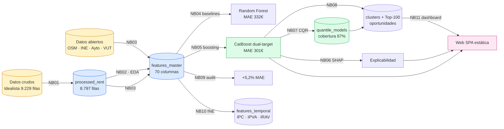
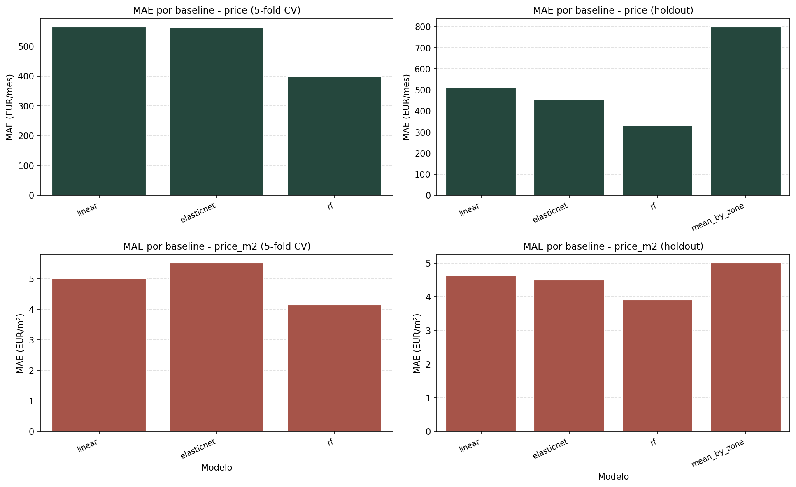
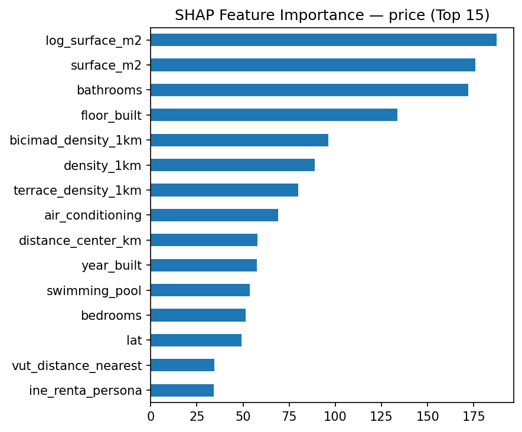
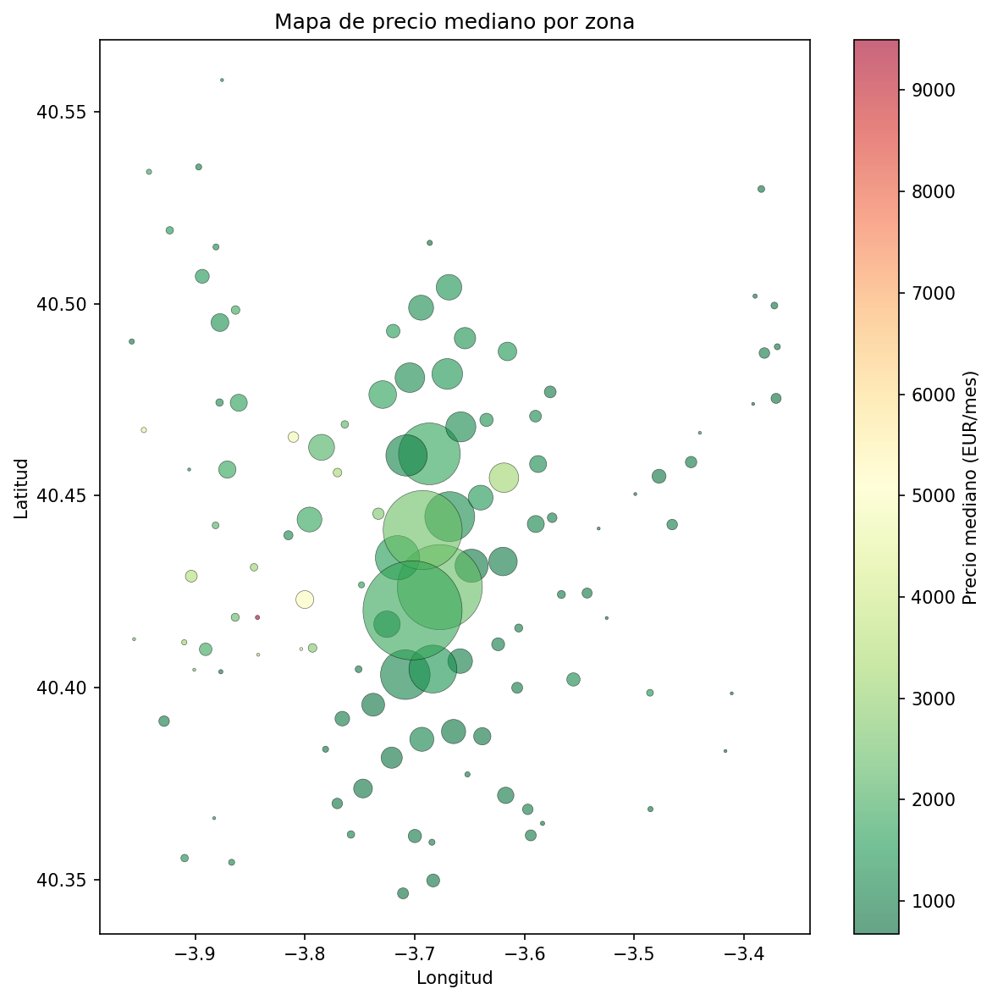
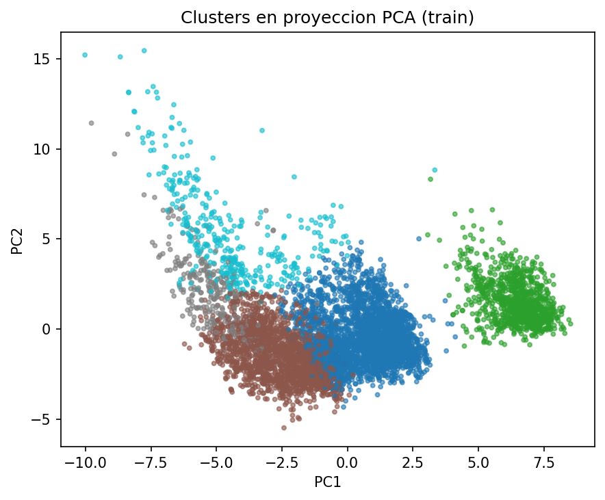
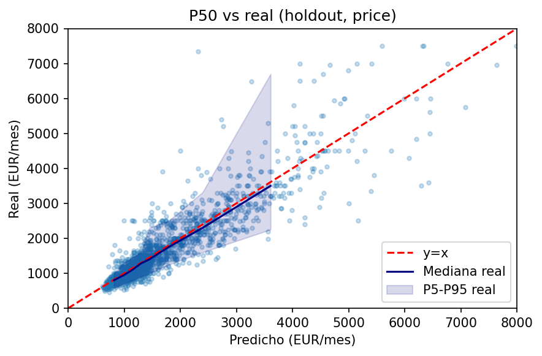
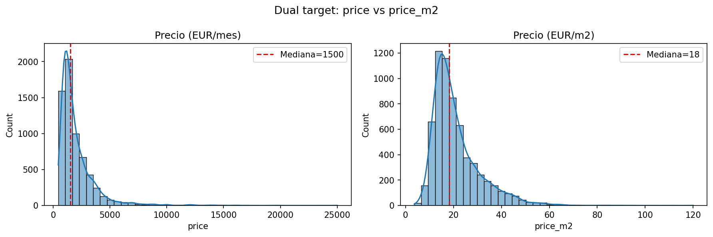

<div align="center">

# RentIA Madrid

### Predicción y análisis de precios de alquiler en Madrid mediante Machine Learning

*Pipeline end-to-end con estimación dual-target, intervalos de confianza calibrados y detección de oportunidades de inversión*

[](https://www.python.org/)
[](https://catboost.ai/)
[](https://scikit-learn.org/)
[](https://pandas.pydata.org/)
[](https://geopandas.org/)
[](https://shap.readthedocs.io/)
[](https://jupyter.org/)
[]()

</div>

<div align="center">

| MAE (€/mes) | R² | Cobertura CQR | Mejora vs RF | Anuncios |
| :---: | :---: | :---: | :---: | :---: |
| **301,31 €** | **0,831** | **87,0 %** | **−9,4 %** | **8.797** |

*Métricas finales sobre holdout temporal (target `price`)*

</div>

---

## Tabla de contenidos

- [Resumen ejecutivo](#resumen-ejecutivo)
- [Contexto y objetivos](#contexto-y-objetivos)
- [Características principales](#características-principales)
- [Stack tecnológico](#stack-tecnológico)
- [Estructura del proyecto](#estructura-del-proyecto)
- [Pipeline de datos](#pipeline-de-datos)
- [Notebooks](#notebooks)
- [Fuentes de datos](#fuentes-de-datos)
- [Modelos y métricas](#modelos-y-métricas)
- [Resultados visuales](#resultados-visuales)
- [Aplicación web](#aplicación-web)
- [Instalación y uso](#instalación-y-uso)
- [Reproducibilidad](#reproducibilidad)
- [Reportes generados](#reportes-generados)
- [Limitaciones conocidas](#limitaciones-conocidas)
- [Trabajo futuro](#trabajo-futuro)
- [Autor](#autor)
- [Licencia](#licencia)

---

## Resumen ejecutivo

**RentIA Madrid** es un Trabajo Fin de Grado que aborda el problema de la estimación de precios de alquiler en la ciudad de Madrid combinando microdatos de portales inmobiliarios con datos abiertos del Ayuntamiento, INE y OpenStreetMap. El sistema entrena modelos de **gradient boosting (CatBoost)** sobre **8.797 anuncios** enriquecidos con **19 variables externas** (transporte, ruido, calidad del aire, renta, viviendas turísticas...), aprende de manera simultánea dos targets — precio absoluto (€/mes) y precio por superficie (€/m²) — y produce **intervalos de predicción calibrados** mediante *Conformal Quantile Regression* con cobertura empírica del 87 %. Finalmente, un sistema de *scoring* heteroscedástico filtrado por anomalía conformal detecta el **5,7 %** de anuncios estadísticamente infravalorados y los expone en una **web interactiva** que incluye predictor, cartograma SVG de los 21 distritos y top-10 de oportunidades.

---

## Contexto y objetivos

Este proyecto constituye el **Trabajo Fin de Grado** desarrollado en la **Universidad Carlos III de Madrid** durante el curso **2025–2026**, bajo la dirección de **Miguel Ángel Patricio** y **Antonio Berlanga**. Se sitúa en la intersección entre la ciencia de datos aplicada, la economía urbana y la ingeniería de software, persiguiendo tres objetivos concretos:

1. **Estimación dual-target.** Predecir tanto el alquiler mensual (`price`, €/mes) como el precio normalizado por superficie (`price_m2`, €/m²) para permitir comparaciones justas entre viviendas de distinto tamaño.
2. **Cuantificación de la incertidumbre.** Acompañar cada predicción puntual de un intervalo `[P5, P95]` con garantía estadística de cobertura mediante CQR, no de bandas heurísticas.
3. **Detección de oportunidades.** Identificar de forma objetiva pisos publicados por debajo de su valor estimado con un filtro conformal unilateral al 95 %, evitando falsos positivos.

---

## Características principales

- **Modelado dual-target** con CatBoost optimizado por Optuna (4.997 trials, profundidad 8, lr 0.299).
- **Enriquecimiento masivo** con 19 features externas: distancias y densidades a Metro, BiciMAD y EMT; renta INE, edad media y tamaño del hogar; ruido (dB) y NO₂; viviendas turísticas (VUT); zonas verdes, terrazas y licencias comerciales.
- **5 esquemas de validación cruzada**: hold-out temporal con purga de 1 día, K-Fold estratificado, Time-blocked CV, Spatial CV por geohash-6 y Grouped CV por distrito.
- **Intervalos calibrados** mediante *Conformal Quantile Regression* con corrección de *quantile crossing* y dos modos (raw y log).
- **Explicabilidad** con SHAP `TreeExplainer` global y local, con fallback a *permutation importance*.
- **Clustering K-Means** (k=5, Silhouette 0,188, ARI 0,999) sobre features comportamentales del mercado.
- **Scoring triple** de oportunidades: z-score heteroscedástico, normalización MAD y consenso por rank-percentile.
- **Web SPA** estática (HTML/CSS/JS vanilla) con Service Worker offline, modo oscuro, exportación a PDF y permalinks compartibles.
- **Reproducibilidad total**: semilla global `SEED = 100432070` (mi NIU), Git LFS para artefactos pesados, checksums SHA-256 y logs de descarga.

---

## Stack tecnológico

| Capa | Librerías |
| :--- | :--- |
| **Lenguaje** | Python 3.13.7 |
| **Datos / cómputo** | `pandas` 2.3.3 · `numpy` 2.3.5 · `scipy` 1.17.0 · `pyarrow` 23.0.1 · `fastparquet` 2025.12.0 |
| **Machine Learning** | `scikit-learn` 1.8.0 · `catboost` 1.2.8 · `lightgbm` 4.6.0 · `xgboost` 3.1.3 · `optuna` (estudios en `models/optuna_studies.db`) |
| **Geoespacial** | `geopandas` 1.1.2 · `shapely` 2.1.2 · `pyproj` 3.7.2 · `pyogrio` 0.12.1 · `h3` 4.4.2 · `geohash2` 1.1 · `rasterio` 1.5.0 |
| **Explicabilidad** | `shap` 0.50.0 · `graphviz` 0.21 |
| **Visualización** | `matplotlib` 3.10.8 · `seaborn` 0.13.2 · `plotly` 6.5.1 · `folium` |
| **Notebooks** | `jupyterlab` 4.5.2 · `ipywidgets` 8.1.8 · `notebook` 7.5.2 |
| **I/O** | `requests` 2.32.5 · `openpyxl` 3.1.5 · `xlsxwriter` 3.2.9 · `joblib` 1.5.3 · `tqdm` 4.67.1 |
| **Web** | HTML5 · CSS3 (dark mode, responsive) · JavaScript vanilla · Service Worker · SVG inline |

> Listado completo disponible en [`reports/environment.txt`](reports/environment.txt).

---

## Estructura del proyecto

```text
TFG_SPA_Madrid/
├── data/
│   ├── raw/                                       # Dataset Idealista + metadatos de generación
│   │   ├── madrid_rent_with_geolocation.csv       # Microdato base de Idealista (9.229 anuncios, 34 columnas)
│   │   ├── alquiler_barrios_madrid_oct2025.js     # Array JS con precios agregados por barrio (Oct 2025)
│   │   └── Como_se_ha_generado_el_dataset_*.txt   # Documentación del proceso de obtención y limpieza
│   └── external/                                  # Datos abiertos para enriquecimiento
│       ├── admin/                                 # Shapefiles distritos, barrios, secciones censales
│       ├── env/                                   # Ruido (GeoTIFF), calidad del aire, parques
│       ├── mobility/                              # Metro, BiciMAD, GTFS de EMT
│       ├── socioeco/                              # INE, IRPF, SERPAVI
│       ├── timeseries/                            # IPC, IPVA, IRAV
│       └── urban/                                 # VUT, terrazas, licencias, tráfico
│
├── notebooks/                                     # 11 notebooks numerados (ejecutar en orden)
│   ├── 01_data_quality.ipynb                      # Ingesta, deduplicación, validación y split hold-out temporal
│   ├── 02_eda.ipynb                               # Análisis exploratorio: distribuciones, correlaciones, geohash
│   ├── 03_features_core.ipynb                     # Ingeniería de features core + enrichment + VUT espacial
│   ├── 04_baselines.ipynb                         # Modelos baseline (media, OLS, ElasticNet, Random Forest)
│   ├── 05_boosting.ipynb                          # CatBoost dual-target con CV temporal/espacial y Optuna
│   ├── 06_explainability.ipynb                    # SHAP global/local + Permutation Importance + PDP/ICE
│   ├── 07_uncertainty.ipynb                       # Conformal Quantile Regression e intervalos calibrados
│   ├── 08_clustering_opportunities.ipynb          # K-Means + scoring heteroscedástico + filtro conformal
│   ├── 09_open_data_enrichment.ipynb              # Auditoría A/B del impacto del enriquecimiento (+5,2 % MAE)
│   ├── 10_temporal_trends.ipynb                   # Integración de series INE (IPC, IPVA, IRAV) y CV temporal
│   └── 11_dashboard_mvp.ipynb                     # Dashboard interactivo con ipywidgets y mapas multicapa
│
├── src/
│   └── utils.py                                   # 47 funciones compartidas (download, geo, CV, eval...)
│
├── artifacts/                                     # Outputs reutilizables (gestionados con Git LFS)
│   ├── processed_rent.parquet                     # Dataset limpio (8.797 filas, 38 columnas)
│   ├── features_master.parquet                    # Dataset maestro: 70 columnas (core + enrichment)
│   ├── features_core.parquet                      # Subconjunto sin enrichment (fallback)
│   ├── features_enriched.csv.gz                   # Dataset con enrichment en CSV comprimido (49 features)
│   ├── features_temporal.csv.gz                   # Features temporales empalmadas con series INE
│   ├── clusters.csv                               # Asignación de cluster (K=5) por anuncio
│   ├── selected_features.json                     # Features finales por consenso SelectKBest + SHAP + Permutation
│   ├── barriosMadrid.json                         # 146 barrios con coordenadas, medianas y metadatos
│   └── splits/                                    # Índices inmutables del hold-out (npz + csv + config)
│
├── models/                                        # Modelos serializados (~252 MB con LFS)
│   ├── best_model.joblib                          # CatBoost single-target (legacy, 11,7 MB)
│   ├── best_models.joblib                         # Dual-target {price, price_m2} (230,8 MB)
│   ├── quantile_models.joblib                     # Modelos cuantílicos CQR (2,3 MB)
│   └── optuna_studies.db                          # Histórico de búsqueda de hiperparámetros (SQLite)
│
├── reports/                                       # Métricas, figuras y documentación técnica
│   ├── figures/                                   # 30 PNG: EDA, SHAP, mapas, incertidumbre
│   ├── slides/                                    # Material de presentación (trabajo futuro)
│   ├── *.csv / *.json / *.md                      # Métricas estructuradas y reportes técnicos
│   └── environment.txt                            # Listado exacto de dependencias (155 paquetes)
│
├── web/                                           # SPA estática (sin backend, sin build step)
│   ├── index.html                                 # Landing + predictor + mapa + oportunidades
│   ├── app.js                                     # Lógica de predicción y UI
│   ├── styles.css                                 # Diseño responsive + dark mode
│   ├── sw.js                                      # Service Worker offline
│   ├── og-image.svg                               # Imagen social (1200×630) para enlaces compartidos
│   ├── metodologia.html                           # Documentación técnica para usuario final
│   ├── sobre.html / contacto.html / ...           # Páginas legales e institucionales (RGPD, LSSI)
│   ├── data/opportunities_pool.json               # Top-100 oportunidades servidas a la web
│   └── README.md                                  # Guía para lanzar el servidor local
│
├── .gitattributes                                 # Configuración Git LFS (csv, parquet, zip, tif)
├── .gitignore                                     # Excluye artifacts/** (gestionados por LFS)
└── README.md                                      # Archivo explicativo del proyecto
```

---

## Pipeline de datos



---

## Notebooks

Los 11 notebooks forman una secuencia ejecutable: cada uno consume artefactos del anterior y emite los suyos a `artifacts/`, `models/` o `reports/`.

| # | Notebook | Propósito | Output principal |
| :---: | :--- | :--- | :--- |
| 01 | [`01_data_quality.ipynb`](notebooks/01_data_quality.ipynb) | Ingesta, deduplicación, validación de precio y superficie, filtrado geográfico, split hold-out temporal | `processed_rent.parquet`, `splits/` |
| 02 | [`02_eda.ipynb`](notebooks/02_eda.ipynb) | Análisis exploratorio: distribuciones, correlaciones, patrones espaciales por geohash | Figuras `hist_*`, `mapa_*`, `boxplot_*` |
| 03 | [`03_features_core.ipynb`](notebooks/03_features_core.ipynb) | Ingeniería de features core + enrichment + VUT espacial con BallTree | `features_master.parquet` (70 cols) |
| 04 | [`04_baselines.ipynb`](notebooks/04_baselines.ipynb) | Modelos baseline: media por zona, OLS, ElasticNet, Random Forest | `baselines_metrics.csv` |
| 05 | [`05_boosting.ipynb`](notebooks/05_boosting.ipynb) | CatBoost dual-target con CV temporal/espacial y Optuna | `best_models.joblib`, `best_hyperparams.json` |
| 06 | [`06_explainability.ipynb`](notebooks/06_explainability.ipynb) | SHAP global y local + Permutation Importance + PDP/ICE | `feature_importances*.csv`, `shap_importance_*.png` |
| 07 | [`07_uncertainty.ipynb`](notebooks/07_uncertainty.ipynb) | Conformal Quantile Regression con clipping y calibración | `quantile_models.joblib`, `uncertainty_metrics.csv` |
| 08 | [`08_clustering_opportunities.ipynb`](notebooks/08_clustering_opportunities.ipynb) | K-Means + scoring heteroscedástico + filtro conformal | `clusters.csv`, `opportunities_top*.csv` |
| 09 | [`09_open_data_enrichment.ipynb`](notebooks/09_open_data_enrichment.ipynb) | Auditoría A/B del impacto de enrichment (+5,2 % MAE) | `enrichment_impact.md` |
| 10 | [`10_temporal_trends.ipynb`](notebooks/10_temporal_trends.ipynb) | Integración de series INE (IPC, IPVA, IRAV) y CV temporal blocked | `features_temporal.csv.gz` |
| 11 | [`11_dashboard_mvp.ipynb`](notebooks/11_dashboard_mvp.ipynb) | Dashboard interactivo con ipywidgets, mapas multicapa y explicación dual | Dashboard renderizado in-notebook |

---

## Fuentes de datos

| Fuente | Tipo | Variables aportadas | Cobertura |
| :--- | :--- | :--- | :---: |
| **Idealista** | Microdato CSV | 34 columnas base: precio, superficie, habitaciones, equipamiento, geolocalización | 100 % |
| **OpenStreetMap** | Vectorial (puntos/polígonos) | Distancia y densidad a Metro, BiciMAD, EMT, terrazas, locales y zonas verdes | 67–100 % |
| **INE — Censo 2021** | Tabular por sección censal | Renta personal, edad media, tamaño del hogar, % hogares unipersonales | 68,5 % |
| **Ayto. Madrid** | Raster GeoTIFF + tabular | Ruido (`Lden`, `Ld`, `Le`, `Ln` en dB), NO₂, parques, arbolado | 65–100 % |
| **Catastro / Ayto.** | Vectorial (polígonos VUT) | Conteo, distancia y densidad de Viviendas de Uso Turístico | 67,5 % |
| **INE — Series temporales** | CSV mensual/anual | IPC, IPVA (precios vivienda), IRAV (referencia alquiler) | Mensual |
| **MITMA — SERPAVI** | Excel histórico | Índice estatal del precio del alquiler (referencia, no feature) | 2018 |
| **Administrativo** | Shapefiles | 21 distritos · 146 barrios · ~400 secciones censales | 100 % |

Todas las descargas quedan registradas en [`reports/download_log.jsonl`](reports/download_log.jsonl) con sus *checksums* en [`reports/download_checksums.csv`](reports/download_checksums.csv).

---

## Modelos y métricas

### Comparativa de modelos (target `price`)

| Modelo | Técnica | MAE hold-out | R² hold-out | Mejora vs OLS |
| :--- | :--- | :---: | :---: | :---: |
| Media por zona | Regla simple | 798,64 € | 0,057 | — |
| Regresión Lineal (OLS) | Baseline lineal | 509,82 € | 0,679 | — |
| ElasticNet | L1 + L2 | 456,28 € | 0,694 | −10,5 % |
| Random Forest | 200 árboles | 332,18 € | 0,811 | −34,8 % |
| **CatBoost (final)** | **Boosting + Optuna** | **301,31 €** | **0,831** | **−40,9 %** |

### Métricas finales en hold-out

| Target | MAE CV | MAE hold-out | R² hold-out | Cobertura CQR | Anchura media P5–P95 |
| :--- | :---: | :---: | :---: | :---: | :---: |
| `price` (€/mes) | 391,48 € | **301,31 €** | **0,831** | **87,0 %** | 1.359,75 € |
| `price_m2` (€/m²) | 3,87 €/m² | **3,17 €/m²** | **0,521** | **87,1 %** | 14,71 €/m² |

> Cobertura nominal objetivo: 85 %. Ambos targets la superan ligeramente, evidenciando que CQR está bien calibrado.

### Impacto del enriquecimiento (auditoría NB09)

| Configuración | Features | MAE hold-out | Δ vs solo core |
| :--- | :---: | :---: | :---: |
| Solo core | 49 | 315,26 € | baseline |
| Core + enrichment | 70 | **298,87 €** | **−5,2 %** |

Cinco de las 15 features más importantes (33 %) provienen del enriquecimiento, validando su incorporación: `ine_renta_persona`, `bicimad_density_1km`, `terrace_density_1km`, `vut_distance_nearest`, `dist_metro_m`.

---

## Resultados visuales

<div align="center">

### Comparativa de modelos baseline vs boosting


### Importancia de features (SHAP) — target `price`


### Mapa de precio mediano por geohash-6


### Clustering de mercado proyectado en PCA


### Intervalos de predicción calibrados (CQR) — vista zoom


### Comparativa dual-target: `price` vs `price_m2`


</div>

> Galería completa de 30 figuras disponible en [`reports/figures/`](reports/figures/).

---

## Aplicación web

La carpeta [`web/`](web/) contiene una **Single Page Application** totalmente autónoma que materializa el modelo en una interfaz pública.

### Funcionalidades

- **Predictor interactivo** con 19 variables agrupadas en *Vivienda*, *Equipamiento* y *Entorno*. Devuelve estimación puntual, intervalo P5–P95, factores SHAP locales y nivel de confianza.
- **4 presets rápidos**: Centro clásico, Salamanca reformado, Tetuán estudio, Vallecas familiar.
- **Cartograma SVG** de los 21 distritos como hexágonos honeycomb, coloreados por €/m² con ranking sincronizado.
- **Top-10 oportunidades** con tres rankings (mixto, descuento €, descuento €/m²), filtros por distrito/precio/superficie y modo "A medida" con pesos personalizables.
- **Comparador** lado a lado de hasta 3 distritos sobre 9 métricas.
- **Modo oscuro** persistente, exportación a PDF, copia de resumen al portapapeles y permalinks compartibles.
- **PWA-ready**: Service Worker cachea assets para uso offline.

### Cómo lanzarla

```bash
# Opción A — Python (recomendado)
python -m http.server 8000 --directory web

# Opción B — Node
npx serve web
```

Abrir `http://localhost:8000` en el navegador. Más detalles en [`web/README.md`](web/README.md).

---

## Instalación y uso

### Requisitos previos

- **Python 3.13.7** (versión exacta usada en desarrollo)
- **Git** y **Git LFS** (para descargar `artifacts/` y `models/` pesados)
- ~3 GB libres en disco (modelos + datos)

### Pasos

```bash
# 1. Clonar el repositorio (con LFS)
git lfs install
git clone <repo-url> TFG_SPA_Madrid
cd TFG_SPA_Madrid

# 2. Crear entorno virtual
python -m venv .venv
.\.venv\Scripts\Activate.ps1     # Windows PowerShell
# source .venv/bin/activate       # macOS / Linux

# 3. Instalar dependencias
#    (no existe requirements.txt — se usa el snapshot de environment.txt)
pip install -r reports/environment.txt
```

### Ejecutar los notebooks

Lanzar JupyterLab y ejecutar los notebooks en orden numérico (01 → 11):

```bash
jupyter lab notebooks/
```

Cada notebook está auto-contenido y reutiliza funciones de [`src/utils.py`](src/utils.py).

### Levantar la web

```bash
python -m http.server 8000 --directory web
```

---

## Reproducibilidad

| Elemento | Mecanismo |
| :--- | :--- |
| **Semilla aleatoria** | `SEED = 100432070` aplicada de forma global en todos los notebooks (NumPy, sklearn, CatBoost, splits) |
| **Splits inmutables** | Índices del hold-out persistidos en [`artifacts/splits/holdout_indices.npz`](artifacts/splits/) |
| **Hiperparámetros** | Estudios Optuna persistidos en [`models/optuna_studies.db`](models/optuna_studies.db) y best-trial en [`reports/best_hyperparams.json`](reports/best_hyperparams.json) |
| **Versionado de datos pesados** | Git LFS aplicado a `*.csv`, `*.parquet`, `*.zip`, `*.tif` (ver [`.gitattributes`](.gitattributes)) |
| **Trazabilidad de descargas** | Logs en [`reports/download_log.jsonl`](reports/download_log.jsonl) + checksums SHA-256 en [`reports/download_checksums.csv`](reports/download_checksums.csv) |
| **Esquemas de CV** | Documentados en [`reports/cv_schemes.md`](reports/cv_schemes.md) |
| **Diccionario de datos** | [`artifacts/data_dictionary.csv`](artifacts/data_dictionary.csv) |

---

## Reportes generados

La carpeta [`reports/`](reports/) contiene la documentación técnica estructurada, lista para consultar sin abrir los notebooks:

| Documento | Contenido |
| :--- | :--- |
| [`feature_selection.md`](reports/feature_selection.md) | Método de consenso (SelectKBest + SHAP + Permutation), p-values, justificación de las 24/39 features finales |
| [`enrichment_impact.md`](reports/enrichment_impact.md) | A/B testing del impacto del enriquecimiento sobre el MAE |
| [`enrichment_missing.md`](reports/enrichment_missing.md) | Cobertura por feature y estrategia de imputación |
| [`cv_schemes.md`](reports/cv_schemes.md) | Esquemas de validación cruzada: temporal, espacial, K-Fold, Grouped |
| [`temporal_limitations.md`](reports/temporal_limitations.md) | Diagnóstico consolidado sobre la dimensión temporal |
| [`target_selection.md`](reports/target_selection.md) | Justificación de la estrategia dual-target |
| [`parse_numeric_report.md`](reports/parse_numeric_report.md) | Documentación del parsing robusto de campos numéricos |
| [`traceability_summary.md`](reports/traceability_summary.md) | Trazabilidad end-to-end de origen y transformaciones |
| [`data_report.json`](reports/data_report.json) | Resumen cuantitativo de la calidad de los datos |
| [`environment.txt`](reports/environment.txt) | Snapshot completo del entorno Python (155 paquetes) |

---

## Limitaciones conocidas

- **Snapshot temporal acotado.** El dataset cubre un período corto (principalmente finales de 2025) y el microdato crudo solo contiene día/mes, no año, por lo que las features temporales (NB10) están **reservadas para un futuro análisis y no se incorporan al modelo principal**.
- **Cobertura parcial en algunas fuentes**: INE censal (68,5 %), ruido (65 %), VUT espacial (67,5 %) requieren imputación o se restringen a subconjuntos.
- **`price_m2` más difícil de predecir** (R² = 0,521) debido a factores cualitativos no observados (estado real del inmueble, vistas, orientación, marketing del anuncio...).
- **CQR en `price`**: cobertura 87,0 % frente a un objetivo de 85 %.

---

## Trabajo futuro

Líneas recogidas en la presentación [`reports/slides/trabajo_futuro_spatio_temporal.pptx`](reports/slides/):

- **Modelos espacio-temporales** que integren las series INE de forma explícita (no solo como features estáticas) y capturen tendencias por zona.
- **Reentrenamiento periódico** mensual con nuevas capturas de Idealista, automatizado.
- **Base de datos espacial** (PostgreSQL + PostGIS) para consultas geográficas eficientes.
- **Incorporar fotografía y NLP** sobre títulos/descripciones de los anuncios para capturar factores cualitativos.

---

## Autor

**Samuel Fernández Fernández**
[](mailto:samufernandezf@gmail.com)

Trabajo Fin de Grado — **Universidad Carlos III de Madrid** · Curso **2025–2026**

**Tutores:** Miguel Ángel Patricio · Antonio Berlanga

---

## Licencia

> Cualquier uso, distribución o derivado de este código y de sus datos debe acordarse previamente con el autor.

---

<div align="center">

*Construido con Python, CatBoost y datos abiertos de Madrid.*

</div>
